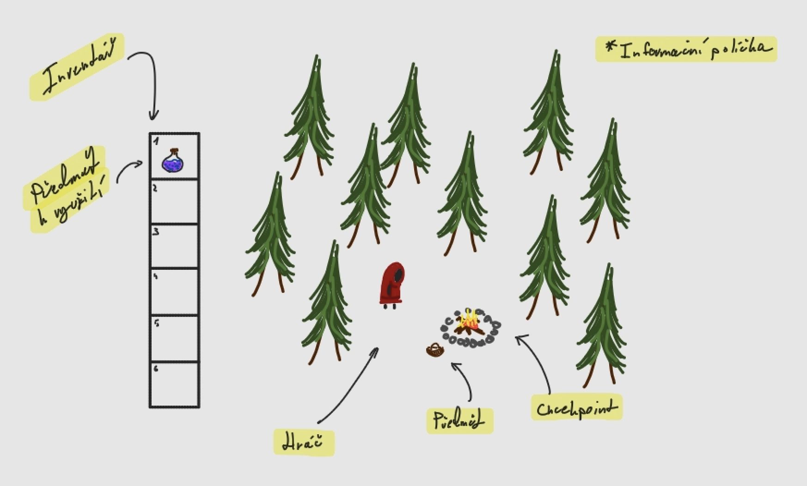

# RED:Cape
- Author: Erik Vaněk
- Semester project at CTU FEE - Software Engineering in the PJV course

## Table of Contents
1. [Chosen Project Theme](#chosen-project-theme)
2. [Management Summary](#management-summary)
3. [Detailed Description of Functionality](#detailed-description-of-functionality)
	- [Game Progress and Goal](#game-progress-and-goal)
	- [Characters](#characters)
	- [Items](#items)
	- [Controls](#controls)
	- [Loading and Saving](#loading-and-saving)
4. [Meeting Required Requirements and Technologies](#meeting-required-requirements-and-technologies)
5. [Designs and Wireframes](#designs-and-wireframes)

## Chosen Project Theme
The game *RED:Cape* is a 2D top-down adventure inspired by the Little Red Riding Hood fairy tale. The player moves through a forest, collects items, and tries to escape from a wolf that pursues them. Using collected items, the player can gain advantages during the game.

## Management Summary
The project aims to create a fun and simple game that combines elements of strategy and survival. The player finds themselves in a forest where they must collect useful items and cleverly avoid the wolf that tirelessly tries to find them. A key aspect of the game is the proper use of inventory and interaction with the environment, which provides players with opportunities.

The game will be designed to be intuitive. Controls will be straightforward, but tactical decision-making about item usage and proper movement planning will be key to survival. The game implementation will meet all requirements specified in the assignment, including the use of threads, testing, and logging.

Development will proceed iteratively with regular commits to GitLab and documentation that will include both a user manual and technical system description.

## Detailed Description of Functionality
### Game Progress and Goal
- Player starts in the middle of the forest and must find a way out without being caught by the wolf
- Collects various items along the way that help them survive
- The game ends in one of two scenarios:
	- Victory - player finds the key to unlock the exit way out of the forest
	- Defeat - wolf catches the player

### Characters
- Player / Little Red Riding Hood
	- Movement in eight directions
	- Ability to interact with items and environment
		- items on the ground, campfire for saving the game
	- Inventory with limited capacity
	- Various movement speeds depending on circumstances
- Wolf
	- AI movement
	- Chases the player / Little Red Riding Hood

### Items
| Name      | Function                                    |
|-----------|---------------------------------------------|
| Key parts | needed to construct a key                   |
| Key       | for unlocking the way out towards victory   |
| Cake      | can be used to heal player                  |
| Potion    | temporarily increases player movement speed |

*item list is not final and may still change*

### Controls
- Movement: WASD
- Item use: 1, 2, 3, 4, 5
  - based on inventory item position

### Loading and Saving
- Saving will occur whenever the player reaches a checkpoint
- Player can continue from the last checkpoint after restarting the game

## Meeting Required Requirements and Technologies
- Implementation in **Java 21**
- Version control with **Git** on the school **GitLab**
- Use of **threads** for game loop and saving
- **JUnit** tests for key classes
- **Logging** with the ability to activate/deactivate at launch
- **GUI** created manually

## Designs and Wireframes
### Gameplay
Basic raw design with GUI

---
*Document may be updated - 22.05.2025*