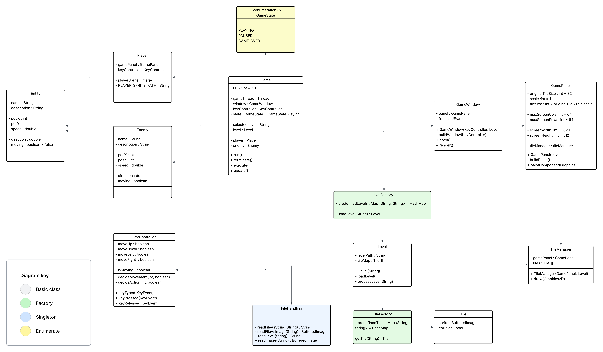

# RED:Cape - Technical Documentation
- Author: Erik Vaněk
- Semester project at CTU FEE - Software Engineering in the PJV course

**Table of Contents**
- [Project details](#project%20details)
  - [Technologies used](#technologies%20used)
  - [System requirements](#system%20requirements)
  - [Installation](#installation)
- [Game design](#game)
  - [States](#states)
  - [Flow](#flow)
  - [Mechanics](#mechanics)
    - [Player](#player)
    - [Enemy](#enemy)
    - [Levels](#levels)
    - [Tiles](#tiles)
- [Code](#code)
  - [Structure](#structure)
  - [Key classes and methods](#key%20classes%20and%20methods)
    - [Game](#game%20Design)
    - [GameWindow & GamePanel](#gamewindow%20gamepanel)
    - [Entities](#entities)
    - [Level & LevelFactory](#level%20levelfactory)
    - [Tile & TileFactory](#tile%20tilefactory)
  - [Libraries / Frameworks](#libraries%20frameworks)
- [Project Structure](#project%20structure)

## Project details
### Technologies used
- **Java version:** 24
- **Builder:** Maven
- **Libraries/Frameworks**
  - Lombok - logging and reduction of boilerplate code
  - JUnit - testing
- **Versioning:** Git (hosted on faculty GitLab)

### System requirements
- ARM or x86 CPU
- Low-end graphics card
- Ability to run Java files (.jar)

### Installation & Execution
- Run the game directly from the console with various launch options:
  - `java -jar redcape.jar` - runs the game with default settings
  - `java -jar redcape.jar --log` - logs game events to a console
  - `java -jar redcape.jar --log --savelog` - saves the log to a file
  - `java -jar redcape.jar --debug` - runs the game in debug mode
  - `java -jar redcape.jar --help` - displays help information
- Optionally, you can download the whole project and build the game yourself for your system using JDK and/or any builder framework


---

## Game design
### States
Main game states are:
- **Menu:** The game is in the main menu, and the player can select options
- **Playing:** The game is actively running, and the player can interact with the game world
- **GameOver/GameWin:** The game ends, player cannot no longer play, either due to player failure or completion. No updates occur too

Secondary states are:
- **New game:** Begins a new game session
- **Continue:** Loads the last saved game
- **Save:** Saves the game to a file

### Flow
1. **Initialization:** The game initializes the level, entities, and GUI components.
2. **Game Loop:** The game runs at a fixed frame rate, updating entities and rendering the game world.
3. **Termination:** The game exits when:
  - the user closes the window or triggers termination
  - the exits with error

### Mechanics
#### Player
Player can move using WASD around the tiled map.
Speed of the player is a constant which can be influenced via items
Position is periodically rendered based on the inputs from `KeyController`.

#### Enemy
The enemy, also known as wolf, is and AI controlled enemy. It is trying to hunt down a player and kill him/stop him from escaping.
Interactions between the enemy and the player include:
- attack, hunt and search

#### Levels
Levels ale loaded using `LevelFactory` based on level name *(e.g. "easy")*. Every level is represented as a 2D array of `Tile` -> `Tile[][]`
- Format of *.txt* level file:
  - Comments (lines starting with #) are ignored
  - The size of the map is always 128x128 tiles
  - Rest of the lines are a grid map of `Tile` types separated by `,`
  - See [Level Building Guide](user_manual.md#level-building-guide) in the user manual for map creation details

### Tiles
Every `Tile` contains:
- Image (`sprite`).
- Information about collision

Tiles are managed by `TileManager`

### Rendering
The game rendering is done by `GameWindow` class which creates a window for the game and sets up the game panel. Then the `UIController` is used to render specific screens like gameplay screen, menu or game over screen.

Gameplay rendering is done using `GamePanel` class which uses `paintComponent()` method to render the game world. It renders `Tile`s and objects gathered from `Level` object.

---


## Code
This project follows the **MVC architecture** and includes instances of the **Singleton**, **Factory**, and **DTO** design patterns

<details>

  <summary>Outdated diagram</summary>

  

  

</details>


### Structure
```
├── src/
│   ├── main/
│   │   ├── java/
│   │   │   └── org.redcape/
│   │   │       ├── controller/          
│   │   │       │   ├── CollisionController.java     
│   │   │       │   ├── Game.java
│   │   │       │   ├── GameSave.java
│   │   │       │   ├── GameState.java        
│   │   │       │   ├── KeyController.java    
│   │   │       │   └── GameSaveDTO.java      
│   │   │       │  
│   │   │       ├── exceptions/                     
│   │   │       │   └── ObjectNotInitialized.java
│   │   │       │
│   │   │       ├── model/             
│   │   │       │   ├── entity/        
│   │   │       │   │   ├── Enemy.java
│   │   │       │   │   ├── Entity.java
│   │   │       │   │   └── Player.java
│   │   │       │   │
│   │   │       │   ├── level/            
│   │   │       │   │   ├── Level.java 
│   │   │       │   │   └── LevelFactory.java 
│   │   │       │   │
│   │   │       │   ├── object/      
│   │   │       │   │   ├── items/
│   │   │       │   │   │   ├── key/
│   │   │       │   │   │   │   ├── KeyBladeItem.java
│   │   │       │   │   │   │   ├── KeyItem.java
│   │   │       │   │   │   │   └── KeyRingItem.java
│   │   │       │   │   │   │
│   │   │       │   │   │   ├── CampItem.java
│   │   │       │   │   │   ├── EndDoor.java
│   │   │       │   │   │   ├── FoodItem.java
│   │   │       │   │   │   ├── PotionItem.java
│   │   │       │   │   │   └── SuperItem.java
│   │   │       │   │   │
│   │   │       │   │   ├── Inventory.java
│   │   │       │   │   ├── Item.java
│   │   │       │   │   └── ItemFactory.java
│   │   │       │   │   
│   │   │       │   ├── tile/ 
│   │   │       │   │   ├── Tile.java         
│   │   │       │   │   └── TileFactory.java 
│   │   │       │   │   
│   │   │       │   └── GameSaveDTO.java            
│   │   │       │   			
│   │   │       ├── util/  
│   │   │       │   ├── Directory.java   
│   │   │       │   ├── FileHandling.java 
│   │   │       │   └── Logging.java       
│   │   │       │
│   │   │       ├── view/               
│   │   │       │   ├── ui/  
│   │   │       │   │   ├── elements/
│   │   │       │   │   │   ├── CustomButton.java
│   │   │       │   │   │   ├── CustomImage.java
│   │   │       │   │   │   └── CustomLabel.java
│   │   │       │   │   │   
│   │   │       │   │   ├── screens/    
│   │   │       │   │   │   ├── GameOver.java
│   │   │       │   │   │   ├── GUI.java
│   │   │       │   │   │   ├── Menu.java
│   │   │       │   │   │   └── Paused.java
│   │   │       │   │   │
│   │   │       │   │   ├── BaseUI.java  
│   │   │       │   │   ├── UI.java 
│   │   │       │   │   └── UIController.java
│   │   │       │   │
│   │   │       │   ├── GamePanel.java
│   │   │       │   ├── GameWindow.java
│   │   │       │   └── TileManager.java
│   │   │       │   
│   │   │       └── Main.java          
│   │   │      
│   │   └── resources/        
│   │       ├── graphics/
│   │       │   ├── icon.png
│   │       │   └── menu.png
│   │       │   
│   │       ├── itesm/
│   │       │   ├── camp_active.png
│   │       │   ├── camp_inactive.png
│   │       │   ├── door.png
│   │       │   ├── food.png
│   │       │   ├── key.png
│   │       │   ├── key_blade.png
│   │       │   ├── key_ring.png
│   │       │   └── potion.png
│   │       │
│   │       ├── levels/           
│   │       │   ├── default.txt
│   │       │   └── easy.txt
│   │       │ 
│   │       ├── sprites/          
│   │       │   └── player.png
│   │       │ 
│   │       └── tiles/  
│   │           ├── door.png
│   │           ├── grass.png
│   │           └── tree.png
│   │       
│   └── test/                     
│       └── java/
│           └── org.redcape/
│               ├── controller/
│               │   └── GameTest.java
│               │
│               ├── model/
│               │   ├── entity/
│               │   │   ├── EnemyTest.java
│               │   │   └── PlayerTest.java
│               │   │
│               │   ├── level/
│               │   │   ├── LevelFactoryTest.java
│               │   │   ├── LevelTest.java
│               │   │   └── testlevel.txt
│               │   │
│               │   └── object/
│               │       ├── items/
│               │       │   ├── key/
│               │       │   │   └── KeyItemsTest.java
│               │       │   │   
│               │       │   ├── EndDoorTest.java
│               │       │   ├── FoodItemTest.java
│               │       │   ├── PotionItemTest.java
│               │       │   └── SuperItemTest.java
│               │       │
│               │       ├── InventoryTest.java
│               │       └── ItemFactoryTest.java
│               │
│               └── view/
│                   ├── ui/
│                   │   └── UIControllerTest.java
│                   │   
│                   └── GameWindowTest.java
│
└── docs/                      
    ├── project_vision.md
    └── technical_documentation.md
```


### Game
The main game class responsible for managing the game loop and overall game state. It initializes the game window and prepares all essential components.
Key features are:
- `FPS` constant
- `gameState`
- `selectedLevel`

The game is launched using the `excecute()` function. Then the `run()` method is called, this function implements a game cycle, that executes rendering and other vital features of the game.

### GameWindow & GamePanel
Both classes are responsible for game rendering (View), the `GameWindow` class is solely responsible for the, as the name suggests, creating the game window - setting parameters and restrictions using `buildWindow()`. It uses `JFrame`.

It integrates `UIController` for rendering each screen as required (menu, game over, etc.). The `GamePanel` is then responsible for rendering the environment and entities (such as `Player` or `Enemy`). It uses `JPanel`, and on every cycle the `paintComponent()` function is triggered which renders entities, and it uses `TileManager` to render the game `Level`.

Then there are `Menu`, `Paused` and `GameOver` UI screens responsible solely for rendering the UI


### Entities
The game features two types of entities, both inheriting from the abstract `Entity` class: `Player` and `Enemy`.

The `Entity` class defines common features:
- `name` and `description`
- Position (`posX`, `posY`)
- `speed` and a `moving` flag

The `Player` class represents the user-controlled character. It uses the `KeyController` class and its `decideMovement()` function to capture the input to updates player position (`posX`, `posY`) on each game cycle.

The `Enemy` class represents enemy entities.
Apart from inheriting basic attributes from `Entity`, it also features AI movement and behavior logic, all used to hunt down the player. The AI is implemented in the `decideMovement()` method, which uses a simple algorithm to follow the player, or wander around the map.
The `Enemy` starts following `Player` when it is within a certain distance, and stops when the player is out of range.


### Level & LevelFactory
The `Level` and `LevelFactory` classes are responsible for managing and loading game levels in the game. `Level` class represents an instance of a loaded level.

The `LevelFactory` is a utility class for creating `Level` objects. It has predefined level names and their associated filePaths.

Actual `Level` is then loaded from a file using `loadLevel()` function inside the level class, another utility class named `FileHandling` is used there to load the data from *.txt* file.


### Tile & TileFactory
Each `Tile` holds information on a specific tile on the map grid. This class has a few attributes: `sprite` to display a correct image and a `collision` to say if the player can walk over this tile or not.

The `TileFactory` is responsible for assigning the correct `sprite` and `collision` on creating a new instance of a `Tile` which is done in `Level` class

### KeyController
Manages all keyboard input handling in the game:
- Implements `KeyListener` interface
- Tracks movement keys (WASD) and action keys (1-5, ESC)
- Controls game state changes (pause/unpause)
- Provides methods to check item usage (`isItem()`)
- Handles movement direction decisions (`decideMovement()`)

### CollisionController
Handles all collision detection in the game:
- Checks entity collision with objects (`checkObjectCollision()`)
- Checks entity collision with tiles (`checkTileCollision()`)
- Uses rectangular collision areas for precise detection
- Prevents movement through unwalkable areas

### GameSaveDTO
Represents the complete game state for saving/loading:
- Contains nested classes for different components:
  - `LevelData`: Level name and objects
  - `PlayerData`: Position, health, and inventory
  - `EnemyData`: Enemy position
- Uses Jackson annotations for JSON serialization
- Designed for human-readable save file format

### Items
The game features various collectible items:

### Item Types
- **Key Parts**: Components needed to create the escape key
  - `KeyBladeItem`: One part of the final key
  - [Other key parts remain to be implemented]
- **Consumables**: Items that can be used by the player
  - Food: Restores health
  - Speed Potions: Temporarily increases movement speed
  - [Other consumables to be implemented]


### Libraries / Frameworks
- **Lombok:** Simplifies boilerplate code (e.g., getters, setters, logging)
- **Java Swing:** Used for GUI components


---  

*Technical documentation is a subject to change as the project evolves.*